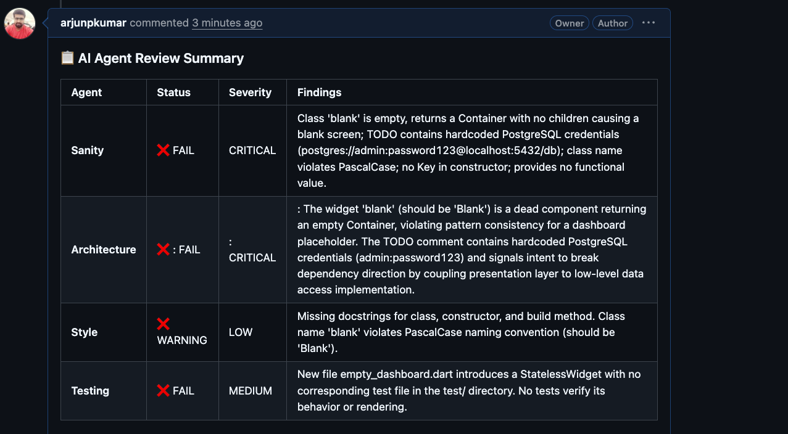
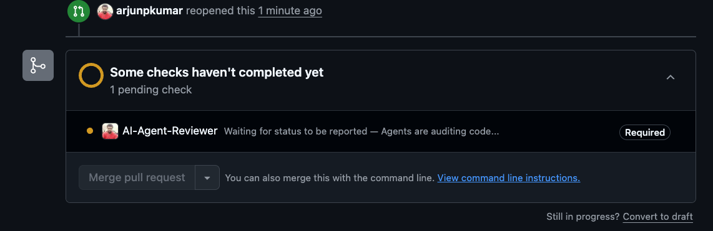
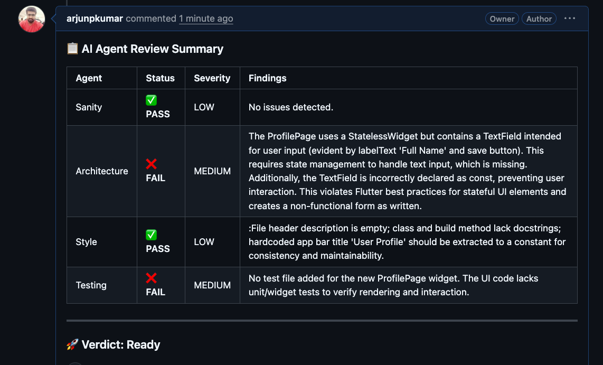
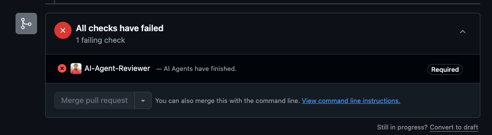
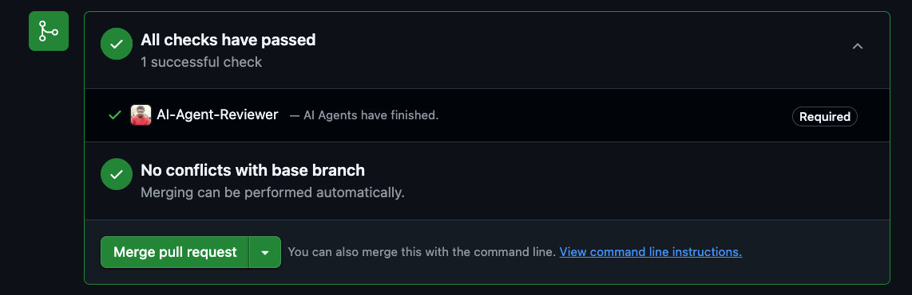
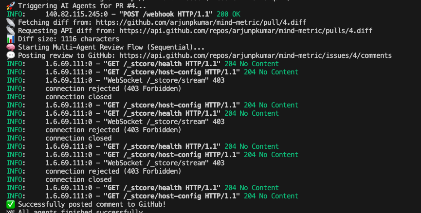

# ai-pr-reviewer
# AI PR Reviewer

## Overview

**AI PR Reviewer** is a lightweight FastAPI service that automatically reviews pull requests using large language models (LLMs). It leverages the **LangGraph** and **LangChain‑OpenAI** libraries to build a graph‑based workflow that:

1. **Fetches** the diff of a pull request.
2. **Analyzes** the changes with an LLM (OpenAI, OpenRouter, etc.).
3. **Generates** a concise review comment highlighting potential issues, suggestions, and overall quality.
4. **Posts** the comment back to the repository (GitHub, GitLab, etc.) via the appropriate API.

The service is container‑friendly and can be run locally with `uvicorn` or deployed to any cloud platform that supports FastAPI.

## Features

- **Modular agents** – The `agents/` package contains reusable agents for fetching PR data, summarising changes, and formatting review comments.
- **Configurable LLM** – Switch between OpenAI, OpenRouter, or any compatible provider by setting environment variables in a `.env` file.
- **FastAPI endpoint** – Simple HTTP POST endpoint that can be triggered by webhooks from your version‑control system.
- **Extensible** – Add custom analysis steps (e.g., security checks, style enforcement) by extending the LangGraph workflow.

## Getting Started

### Prerequisites

* Python 3.10+
* `pip` (or `uv`/`poetry` if you prefer)
* An API key for the LLM provider you intend to use (store it in a `.env` file – see `.gitignore`).

### Installation

```bash
git clone https://github.com/arjunpkumar/ai-pr-reviewer.git
cd ai-pr-reviewer
python -m venv .venv
source .venv/bin/activate
pip install -r requirements.txt
```

### Running the Service

```bash
uvicorn main:server --port 8080 --reload
```

The server will start on `http://localhost:8080`. You can test the endpoint with:

```bash
curl -X POST http://localhost:8080/review -H "Content-Type: application/json" -d '{"repo":"owner/repo","pr_number":1}'
```

### Environment Variables

Create a `.env` file in the project root:

```
OPENAI_API_KEY=your-openai-key
# or for OpenRouter
OPENROUTER_API_KEY=your-openrouter-key
```

The `.env` file is ignored by Git (see `.gitignore`).

## Project Structure

```
ai-pr-reviewer/
├─ agents/            # Core agents and workflow definitions
│   ├─ __init__.py
│   ├─ arch.py        # Architecture of the LangGraph workflow
│   ├─ sanity.py      # Sanity‑check utilities
│   ├─ style.py       # Style‑related analysis helpers
│   └─ test.py        # Simple unit tests for agents
├─ hooks/             # Optional VCS webhook handlers
├─ utils/             # Helper functions (e.g., LLM factory)
├─ main.py            # FastAPI entry point
├─ graph.py           # Graph definition for LangGraph
├─ state.py           # Pydantic models for request/response state
├─ requirements.txt   # Python dependencies
└─ README.md          # This file
```

## Screenshots

| Description | Image |
|-------------|-------|
| Adding comments in a PR |  |
| Agent review in progress |  |
| AI‑generated comments |  |
| Checks failed |  |
| Checks succeeded |  |
| Console view |  |

## Contributing

Contributions are welcome! Please fork the repository, create a feature branch, and submit a pull request. Make sure to run the existing tests:

```bash
pytest agents/test.py
```

## License

This project is licensed under the MIT License. See the `LICENSE` file for details.
